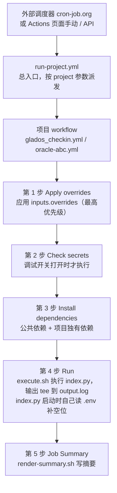

# Auto-Workflow-Scheduler

把各种「需要定时跑一次」的小任务，塞进 GitHub Actions 的免费额度里自动执行。

比如：每天自动签到领积分、盯着一台总是缺货的免费云服务器一直抢。
它们都只需要偶尔跑一下、跑完就结束，用一台常驻服务器太浪费 —— 这个仓库就是干这个的。

---

## 目录

- [郑重提示：不要把机密写进 .env](#郑重提示不要把机密写进-env)
- [1. 这个仓库解决什么问题](#1-这个仓库解决什么问题)
- [2. 目前有哪些任务](#2-目前有哪些任务)
- [3. 整体结构](#3-整体结构)
- [4. 一次运行到底发生了什么（流程图）](#4-一次运行到底发生了什么流程图)
- [5. 快速开始（手把手）](#5-快速开始手把手)
- [6. 配置体系（通用）](#6-配置体系通用)
- [7. 怎么触发一次运行](#7-怎么触发一次运行)
- [8. 跑完以后看什么](#8-跑完以后看什么)
- [9. 在本地跑](#9-在本地跑)
- [10. 新增一个任务](#10-新增一个任务)
- [11. 常见问题（通用）](#11-常见问题通用)
- [12. 文件速查](#12-文件速查)

---

## 郑重提示：不要把机密写进 .env

**一句话结论：cookie、API 私钥、token 这类真正的凭据，一律放 GitHub 的 Secrets，不要写进 `.env`。**

`.env` 这个机制只是为了「本地调试时填点不敏感的东西」，**不要**把它当配置文件的正式载体，更不要往里塞凭据。

为什么，按严重程度排：

| # | 原因 | 后果 |
|---|---|---|
| 1 | **`.env` 就是一个明文文件，没有任何加密** | 一次 `git add .` 手滑就把凭据提交进了 git 历史。git 历史里的东西**删不干净**，等于永久泄露 |
| 2 | **GitHub 的日志自动脱敏对 `.env` 里的值基本失效** | GitHub 只按「完整的 Secrets 值」做字面匹配。`.env` 里的值是本地明文读进来的，跟 Secrets 记录对不上，**脱敏不会触发** |
| 3 | **`.env` 很容易被顺手复制、贴给同事、发到群里排查问题** | 这是最常见的泄露方式，而且往往事后才发现 |
| 4 | **`.env` 会被当成「本地的东西」而放松警惕** | 但如果哪天你把它放到自建 runner 的工作区里，它就会长期生效，比 Secrets 更难被注意到 |

**正确的做法：**

| 想做的事 | 用什么 |
|---|---|
| 长期生效的凭据（cookie、私钥） | **Environment secrets** |
| 长期生效的非敏感配置（域名、开关、目标规格） | **Environment variables** |
| 临时改一次试试，跑完就忘 | **参数覆盖 `inputs.overrides`**（见第 6.4 节） |
| 本地调试想少 export 几个变量 | `.env`（**只放非敏感项**） |

> 本地跑确实需要凭据时，请用 `export` 临时设进程环境变量（不落盘，关掉终端就没了），
> 或者用 `OCI_CLI_KEY_FILE` 这种「指向一个已存在文件」的方式，而不是把私钥内容抄进 `.env`。
>
> 另外 `.env.example`（模板）**是要提交到仓库的**，所以里面**永远只放占位符**，不要填真值。

---

## 1. 这个仓库解决什么问题

### 1.1 为什么不用 GitHub 自带的定时任务

GitHub Actions 自带 `schedule`（cron）触发，但实测**非常不准**：

- 高峰期会延迟几十分钟甚至几小时
- 仓库长期不活跃时会被**自动停用**
- 最短间隔 5 分钟，但触发时间完全不可控

对于「抢一台缺货的服务器」这种需求，等它触发黄瓜菜都凉了。

### 1.2 所以用「外部调度器 + API 派发」

```
外部调度器（cron-job.org 等）
        ↓  定时 POST 一个 HTTP 请求
GitHub API  → 触发指定 workflow
        ↓
workflow 跑你的脚本
        ↓
结果写进 Job Summary + 日志（+ 可选推送）
```

**外部调度器只负责「按时敲门」，实际干活的是 GitHub Actions**，所以：

- 服务器不用你维护（GitHub 免费额度：公开仓库不限时长，私有仓库每月 2000 分钟）
- 定时准不准只取决于那个调度器（cron-job.org 之类基本准时）
- 每个任务独立成一个项目目录 + 一个 workflow + 一个 Environment，互不干扰

### 1.3 设计原则

| 原则 | 具体表现 |
|---|---|
| **workflow 只做声明** | 每个项目的 `.yml` 里只有「配置 + 调用哪个脚本」，没有逻辑 |
| **通用逻辑集中在 `common/`** | 依赖安装、配置自检、参数覆盖、`.env` 加载、执行、摘要渲染，全部是跨语言共享的 shell 脚本 |
| **业务脚本零耦合** | `index.py` 完全不知道 GitHub Actions 的存在，本地和 CI 行为一致 |
| **失败也要有输出** | 摘要 step 用 `if: always()`，脚本崩了也能看到已经产生的日志 |

---

## 2. 目前有哪些任务

| 项目 | 语言 | 做什么 | 建议调度频率 |
|---|---|---|---|
| [`glados_checkin`](python/glados_checkin/README.md) | Python | GLaDOS / Railgun 自动签到（多域名多账号），可选自动兑换套餐 | 每天 1~2 次 |
| [`oracle-abc`](python/oracle-abc/README.md) | Python | 抢 Oracle Cloud 的免费 Ampere A1 实例，抢到后分步升级到目标规格 | 每 1~5 分钟 |

点项目名进各自的 README 看业务细节（要配哪些参数、脚本怎么跑、专属的常见问题）。

---

## 3. 整体结构

```
Auto-Workflow-Scheduler/
│
├── README.md                        ← 你正在看的这个：通用说明（结构 / 流程图 / 配置体系 / 触发 / FAQ）
│
├── common/                          ★ 跨语言共享的「通用逻辑」，全是 shell 脚本
│   ├── install-deps.sh                 按语言装依赖（公共 + 项目独有，两级）
│   ├── check-secrets.sh                配置自检（默认整步跳过，开调试开关才输出）
│   ├── apply-overrides.sh              参数覆盖层（最高优先级）
│   ├── execute.sh                      执行入口脚本，输出同时进日志和 output.log
│   └── render-summary.sh               把 output.log 渲染成 Job Summary
│
├── .github/workflows/
│   ├── run-project.yml                 总入口：按 project 参数派发到对应项目
│   ├── glados_checkin.yml              项目 workflow（只做声明）
│   └── oracle-abc.yml                  项目 workflow（只做声明）
│
├── python/                          ★ Python 语言目录
│   ├── requirements.txt                语言级公共依赖（所有 Python 项目共用）
│   ├── common/                         语言级共享代码包
│   │   ├── __init__.py
│   │   ├── logging_config.py              日志初始化（统一格式，所有 Python 项目共用）
│   │   └── dotenv.py                      .env 读取（最低优先级，业务脚本启动时自己调）
│   │
│   ├── glados_checkin/                 项目目录
│   │   ├── index.py                       入口脚本（业务逻辑）
│   │   ├── requirements.txt               项目独有依赖（requests）
│   │   ├── .env.example                   .env 模板（提交；只放占位符）
│   │   └── README.md                      业务说明
│   │
│   └── oracle-abc/                     项目目录
│       ├── index.py                       入口脚本（业务逻辑）
│       ├── requirements.txt               项目独有依赖（oci）
│       ├── .env.example                   .env 模板
│       └── README.md                      业务说明
│
└── .gitignore                      忽略 output.log 和 .env（但不忽略 .env.example）
```

### 3.1 三个概念别搞混

| 概念 | 是什么 | 在哪 |
|---|---|---|
| **仓库根的 `common/`** | **跨语言**通用逻辑，shell 脚本，所有语言的项目都用 | `common/*.sh` |
| **`python/common/`** | **Python 语言级**共享代码，只有 Python 项目用 | `python/common/*.py` |
| **`python/<项目>/`** | 单个任务的全部内容：入口脚本 + 依赖 + `.env.example` + 说明 | – |

> 为什么 `index.py` 开头要往 `sys.path` 里插两个目录？
> 因为它比包根 `python/` 深一层，得把 `python/` 加进搜索路径才能 `from common.logging_config import ...`。
> 这样无论从仓库根目录还是从项目目录启动都能正常导入。

### 3.2 命名约定

- `.github/workflows/` 下**不以 `run-` 开头**的 `.yml` 就是一个项目，**文件名（去掉 `.yml`）就是项目名**
- `run-` 前缀保留给基础设施（目前只有总入口 `run-project.yml`）
- 项目名统一小写下划线（`glados_checkin`、`oracle-abc`），派发时会自动归一化（`glados-checkin` / `GLADOS_CHECKIN` / `glados_checkin.yml` 都认）

---

## 4. 一次运行到底发生了什么（流程图）

### 4.1 整体流程



不想看 mermaid 的话，纯文字版：

```
外部调度器 / 手动 / API
      ↓
run-project.yml（总入口，把 project 参数解析成具体 workflow）
      ↓
<项目>.yml（只做声明：配置 + 调用 common/*.sh）
      ↓
① Apply overrides   → 把 inputs.overrides 写进环境
② Check secrets     → 配置自检（默认跳过，调试开关打开才跑）
③ Install deps      → 按语言装依赖
④ Run               → execute.sh 执行 index.py，输出同时进日志和 output.log
                      index.py 启动时自己读 .env，补上前两层空着的键
⑤ Job Summary       → render-summary.sh 把 output.log 渲染成摘要
```

### 4.2 配置是怎么一层层叠上去的

```
┌───────────────────────────────────────────────┐
│ ① ref      inputs.overrides（派发时传的 JSON） │  ← 最高优先级
├───────────────────────────────────────────────┤
│ ② vars / secrets   GitHub Environment 配置     │
├───────────────────────────────────────────────┤
│ ③ .env     <项目目录>/.env（本地兜底）         │  ← 最低优先级
└───────────────────────────────────────────────┘
                     ↓
        规则：下面两层只能填补上面空着的键
                     ↓
        最终进程环境变量（业务脚本读到的就是它）
```

对应到脚本：

| 层 | 由谁实现 | 怎么生效 |
|---|---|---|
| ① ref | `common/apply-overrides.sh` | 写进 `$GITHUB_ENV`，后续所有 step 都能读到 |
| ② vars / secrets | 项目 workflow 的 `env:` 块 | GitHub 一开始就注入到进程环境 |
| ③ .env | `python/common/dotenv.py` | 业务脚本**启动时自己读**，只在①②都为空时才写进 `os.environ` |

### 4.3 业务脚本内部（以签到为例）

```
读取配置，把「域名」和「Cookie」按行配成 N 个任务
      ↓
对每个任务依次执行：
  1. 查剩余天数
  2. 执行签到
  3. 查总积分
  4. （可选）兑换
      ↓
汇总所有任务结果 → 输出日志 + 推送
```

每个项目自己的流程图写在各自的 README 里。

---

## 5. 快速开始（手把手）

假设你已经把这个仓库 **fork** 到了自己的账号下，或者直接用了原仓库。下面以 `glados_checkin` 为例，`oracle-abc` 同理，只是配置项不同。

### 5.1 第一步：建一个 Environment

Environment 的作用是**把不同任务的真凭据隔离开** —— 签到用不到 OCI 私钥，抢服务器也用不到你的 cookie。

1. 打开你的仓库页面，点顶部的 **Settings**（设置）
2. 左侧菜单找到 **Environments**（环境）
3. 点 **New environment**
4. 名字填 **`python_glados_checkin`**（必须一字不差，workflow 里写死了这个名字）
5. 点 **Configure environment**

> 为什么要按项目建 Environment 而不是直接放仓库级？
> 因为 Environment 的 secrets 只在引用了这个 Environment 的 job 里可见，
> 万一哪个 workflow 被改坏了，也拿不到别的项目的凭据。

### 5.2 第二步：加 Secrets（敏感值）

在刚建好的 `python_glados_checkin` 页面里，找到 **Environment secrets**，点 **Add secret**。

以 `glados_checkin` 为例：

| Secret 名称 | 必填 | 填什么 |
|---|---|---|
| `COOKIES` | ✅ | 你的账号 Cookie，**每行一个**，和 `DOMAINS` 按行一一对应 |
| `PUSHDEER_SENDKEY` | 选填 | 推送密钥，不填就只输出日志、不推送 |

**Cookie 怎么拿**（`COOKIES` 的值）：

1. 浏览器登录对应站点
2. 按 `F12` 打开开发者工具
3. 切到 **Application**（应用）标签页
4. 左侧展开 **Cookies**，点中该站点
5. 找到并复制形如下面这一整串：

   ```
   koa:sess=xxxxx; koa:sess.sig=yyyyy
   ```

6. 如果有多个账号，**一行一个**粘进 Secret 输入框（Secret 支持多行）

> ⚠️ Cookie 就是你的登录凭据，**等同于账号密码**。所以它必须放 Secret，绝不能进 `.env`、不能提交进仓库。

### 5.3 第三步：加 Variables（非敏感值）

同一个页面往下找到 **Environment variables**，点 **Add variable**。

| Variable 名称 | 必填 | 填什么 | 示例 |
|---|---|---|---|
| `DOMAINS` | ✅ | 要签到的域名，**每行一个**，行数必须和 `COOKIES` 一致 | `glados.cloud` |
| `GLADOS_EXCHANGE_PLAN` | 选填 | 兑换计划。**留空 = 不兑换** | `plan500` |
| `GLADOS_VERBOSE` | 选填 | 是否输出详细日志 | `false` |

> **为什么这些放 Variables 而不是 Secrets？**
> 因为它们不是凭据 —— 域名、开关、计划名，就算被人看到也登不了你的账号。
> 放 Variables 的好处是排查问题时能直接明文看到实际值，非常省事。

### 5.4 第四步：跑一次验证

1. 打开仓库的 **Actions** 标签页
2. 左侧列表点 **glados_checkin**
3. 右边点 **Run workflow** 按钮，再点绿色的 **Run workflow**
4. 等十几秒，列表里会出现一次新的运行，点进去

**怎么判断成功了：**

- 点进运行详情，看 **Summary** 页 —— 应该能看到标题 + 一个默认展开的「完整输出」折叠块
- 展开折叠块，找有没有 `========== 签到总结 ==========` 这一段
- 有这一段，就说明脚本正常跑完了

> ⚠️ **重要**：这个项目的脚本**永远返回退出码 0**，所以即使全部账号签到失败，Actions 页面也是**绿色**的。
> **不要只看红绿**，一定要看日志内容。

### 5.5 第五步：挂上外部调度器

GitHub 自带的 cron 不可靠（见 1.1），所以用外部调度器来定时敲门。

以 **cron-job.org** 为例：

1. 注册并登录 cron-job.org
2. 点 **Create cronjob**
3. **Title** 随便填，比如 `glados-checkin`
4. **URL** 填：

   ```
   https://api.github.com/repos/<你的用户名>/<仓库名>/actions/workflows/run-project.yml/dispatches
   ```

5. **Schedule** 按需设置（签到每天 1~2 次即可；抢服务器建议每 1~5 分钟）
6. 展开 **Advanced** → **Request method** 选 **POST**
7. 在 **Headers** 里加两条：

   | Key | Value |
   |---|---|
   | `Authorization` | `Bearer <你的 GitHub PAT>` |
   | `Accept` | `application/vnd.github+json` |

8. 在 **Request body** 里填：

   ```json
   {"ref":"main","inputs":{"project":"glados_checkin"}}
   ```

9. 保存，点 **Test run** 验证一下

**PAT（Personal Access Token）怎么拿：**

1. GitHub 右上角头像 → **Settings**
2. 左下角 **Developer settings**
3. **Personal access tokens** → **Fine-grained tokens** → **Generate new token**
4. 权限只需要 **Actions: Read and write**（`fine-grained` 的 Repository permissions 里找）
5. 生成后**只显示一次**，马上复制保存

> 调度器会定期帮你打这个请求，所以 PAT 泄露等于别人能触发你的 workflow（但读不到你的 secrets）。
> 因此 token 权限给到最小即可，不要给 `repo` 全权限。

---

## 6. 配置体系（通用）

这一节是所有项目都适用的规则。各项目**要配哪些名字**，在各自的 README 里。

### 6.1 三层优先级

| 层 | 来源 | 典型用途 | 生效范围 |
|---|---|---|---|
| ①（最高） | 派发时的 `inputs.overrides`（JSON） | 临时试一次，不动仓库配置 | 仅本次运行 |
| ② | Environment 的 `secrets` / `vars` | 正式配置 | 长期 |
| ③（最低） | `<项目目录>/.env` | 运行期兜底默认值 | 本次运行 |

**规则一句话：下面两层只能填补上面空着的键，同名项一旦被上层提供了值，下层就失效。**

实现上就是 `python/common/dotenv.py` 那条「只填未设置或为空的键」：

```bash
if [ -n "${!name:-}" ]; then   # 上层已经给了非空值
  continue                     # → 跳过，不动
fi                             # 空 / 未设置 → 由 .env 补上
```

因为 ①② 走到这一步都已经在进程环境里了，「只填空位」天然就等于这个优先级，不需要额外排序。
附带好处：`.env` 不可能改坏 `PATH`、`GITHUB_*` 这类运行时变量（它们永远非空）。

> ⚠️ **「空字符串」被当作「没配置」**：GitHub 上把某个 Variable 留空或不建时，`${{ vars.X }}` 会展开成空字符串，
> 这个键就交给 `.env` 了。代价是**没法显式表达「这个键就是要空着」**。
> 只在本地跑（或自建 runner 保留了 `.env`）时才需要留意 —— CI 是干净检出，根本没有这个文件。

### 6.2 什么放 Secret、什么放 Variable

| 判断标准 | 放哪 |
|---|---|
| 拿到它就能**登录、调用、冒用你的身份** | **Secret** |
| 只是个名字 / 开关 / 数字，被人看到也无所谓 | **Variable** |

举例：

- cookie、API 私钥、token、密码 → **Secret**
- 域名、用户名、邮箱、开关、目标数量、计划名 → **Variable**

> ⚠️ **常见坑**：如果误把某个 Variable 建成了 Secret（或反过来，把引用前缀写错 —— 该用 `vars.` 却写了 `secrets.`），
> GitHub **不会报错**，只会静默解析成**空字符串**，然后代码回退到默认值。
> 表现就是「我明明配了，怎么没生效」。用第 8.3 节的配置自检来确认。

### 6.3 仓库级 vs Environment 级

| 级别 | 建在哪 | 谁可见 | 什么时候用 |
|---|---|---|---|
| **Environment 级** | Settings → Environments → `<环境名>` | 只在该 Environment 里 | **项目自己的配置**，默认都放这里 |
| **仓库级** | Settings → Secrets and variables → Actions | 所有 workflow | 多个项目共用的东西 |

本仓库目前只有一项**仓库级 secret**：

| 名称 | 必填 | 说明 |
|---|---|---|
| `COMMON_FINGERPRINT_KEY` | 选填 | 只供 `common/check-secrets.sh` 生成 HMAC 指纹，**自身永远不会被打印**。不填则自检表该列显示 `(skip: no key)` |

任意长随机字符串即可，生成方式（PowerShell）：

```powershell
(New-Guid).ToString('N') + (New-Guid).ToString('N')
```

> 为什么需要它？自检时 secret 不能明文输出，但又想判断「两次运行的 secret 是不是同一个」。
> 用带密钥的 HMAC 指纹就能做到：值不可见、不能离线爆破，但可稳定比对。

### 6.4 参数覆盖：临时替换一次配置

**场景**：想试试换个域名、换个目标规格，但不想改动仓库里已经配好的东西。

**怎么做**：派发时多传一个 `inputs.overrides`，值是一个 **JSON 对象**：

```json
{"ref":"main","inputs":{"overrides":"{\"DOMAINS\":\"glados.cloud\",\"GLADOS_VERBOSE\":\"true\"}"}}
```

如果值本身是多行（比如 cookie 列表、域名列表），在 JSON 里用 `\n` 转义：

```json
{"COOKIES": "koa:sess=AAA; koa:sess.sig=BBB\nkoa:sess=CCC; koa:sess.sig=DDD",
 "DOMAINS": "glados.cloud\nrailgun.info"}
```

**行为约定：**

| 点 | 说明 |
|---|---|
| 生效范围 | **只影响这一次运行**，仓库里的配置一个字节都不动 |
| 怎么实现的 | `common/apply-overrides.sh`，排在 checkout 之后、其余 step 之前，写进 `$GITHUB_ENV` |
| 白名单 | 只能覆盖 workflow 里登记过的项（默认取 `SECRET_NAMES` + `VARIABLE_NAMES`，可用 `OVERRIDE_NAMES` 单独指定）。越界直接报错 |
| 拒绝项 | `GITHUB_*` / `RUNNER_*` 一律拒绝 —— 防止有人通过覆盖把 runner 环境搞坏 |
| 值不回显 | 日志和摘要里**只列被替换的项名**，绝不显示值 |
| 摘要提示 | Job Summary 最上方会出现「本次运行替换了配置项」表格 |
| 留空 | 不传 / 传空串 / 传 `{}` → 整步跳过，完全使用仓库配置 |

> ⚠️ **`workflow_dispatch` 的 inputs 不是机密** —— 它会出现在 run 的详情页和事件详情里，公开仓库等于公开。
> 所以这个入口适合临时换域名、开关、目标数量这类**非敏感**配置；
> **不要拿它传 cookie / 私钥**。长期配置请老老实实放 `vars` / `secrets`。

**通过总入口传参**：`run-project.yml` 会把 `overrides` **原样转发**给被派发的项目。

```json
{"ref":"main","inputs":{"project":"glados_checkin","overrides":"{\"GLADOS_VERBOSE\":\"true\"}"}}
```

> 被派发的项目 workflow 必须声明 `inputs.overrides`，否则 GitHub 会返回 422。

### 6.5 本地 `.env` 层

**再次强调：这一层只用来放非敏感项，不要放凭据（见开头的郑重提示）。**

每个项目目录下都有一个 `.env.example` 模板（**提交进仓库**，只放占位符）。
想用的时候复制一份：

```bash
cp python/glados_checkin/.env.example python/glados_checkin/.env
```

同目录下的 `.env` 才是实际生效的那个，**已被 `.gitignore` 忽略**。

> ✅ 这一层由**业务脚本自己在启动时读取**（`python/common/dotenv.py`），
> 所以**本地 `python index.py` 同样生效**（见 [9.2](#92-怎么给配置)）。
> 因为它跑在最后，天生只能捡前两层剩下的空位。
>
> 它**只用来放非敏感项** —— 原因见开头的[郑重提示](#郑重提示不要把机密写进-env)。

**格式**：

| 写法 | 结果 |
|---|---|
| `KEY=VALUE` | 原样 |
| `KEY="A\nB"` | 双引号内的 `\n` 还原成**真换行**（多行值就靠它），首尾引号会被去掉 |
| `KEY='A\nB'` | 单引号内完全字面，不做任何转义 |
| `export KEY=VALUE` | `export` 前缀可有可无 |
| `# 注释` / 空行 | 会被忽略 |

> ⚠️ `.env` 里必须写**脚本真正读取的变量名**，不是 GitHub 上那个 Variable 的显示名。
> 有些项目两者不同名（workflow 里做了一层映射），写错**不会报错**，只是配置不生效。
> 具体对应关系看各项目 `.env.example` 里的注释。

---

## 7. 怎么触发一次运行

### 7.1 方式一：通过总入口（推荐）

```
POST https://api.github.com/repos/<owner>/<repo>/actions/workflows/run-project.yml/dispatches
Authorization: Bearer <PAT>
Content-Type: application/json

{"ref":"main","inputs":{"project":"glados_checkin"}}
```

好处：外部调度器只需要配**一个** URL，通过改 `project` 参数就能跑不同任务。

### 7.2 方式二：直达单个项目

```
POST https://api.github.com/repos/<owner>/<repo>/actions/workflows/<项目名>.yml/dispatches
Authorization: Bearer <PAT>
Content-Type: application/json

{"ref":"main"}
```

### 7.3 方式三：Actions 页面手动

**Actions** → 左侧选项目 → **Run workflow**（可以顺便填 `overrides`）

手动触发不需要 PAT，适合调试。

### 7.4 建议的调度方式

| 项目类型 | 建议频率 | 原因 |
|---|---|---|
| 签到类 | 每天 1~2 次 | 一天签一次就够了，多打无益 |
| 抢购类（如 oracle-abc） | 每 1~5 分钟 | 缺货是常态，靠高频重试提高命中率 |

---

## 8. 跑完以后看什么

### 8.1 日志

格式统一：

```
YYYY-MM-DD HH:MM:SS | LEVEL   | message
```

由 `python/common/logging_config.py` 初始化，所有 Python 项目共用，所以每个项目的日志长得一样。

### 8.2 执行摘要（Job Summary）

**业务脚本完全不需要为它做任何事** —— 它照常往 stdout 打日志就行。摘要是 workflow 层做的，分两步：

| 步骤 | 脚本 | 做什么 |
|---|---|---|
| `Run` | `common/execute.sh` | 执行入口脚本，用 `tee` 把输出**同时**写进日志和 `<项目目录>/output.log`（日志仍实时可见） |
| `Job Summary` | `common/render-summary.sh` | 读 `output.log`，包成 Markdown 写进 `$GITHUB_STEP_SUMMARY` |

对应的 workflow 片段：

```yaml
- name: Run
  run: bash common/execute.sh

- name: Job Summary
  if: always()          # 关键：失败时也要把已产生的输出带出来
  env:
    SUMMARY_TITLE: 项目的显示名
  run: bash common/render-summary.sh
```

结果：**不用点进日志 Tab**，在 run 列表页就能直接看到输出。

| 设计要点 | 说明 |
|---|---|
| 业务脚本零耦合 | `index.py` 根本不知道 GitHub Actions 存在，本地与 CI 行为一致 |
| 通用 | 任何项目只要经 `execute.sh` 执行，就能用 `render-summary.sh` 出摘要 |
| 失败也有摘要 | 独立 step + `if: always()`，`Run` 失败时已产生的输出不会丢 |
| 本地静默跳过 | 没有 `GITHUB_STEP_SUMMARY` 时直接跳过，不报错 |

`output.log` 已加入 `.gitignore`。

### 8.3 配置自检

> **自检默认整步跳过** —— `common/check-secrets.sh` 什么都不输出，日志里连表都没有。
> 只有打开调试开关后才会跑。这是故意的：公开仓库的 Actions 日志任何人都能读，
> 而 Variables **完全不受 GitHub 自动脱敏保护**，所以默认连表都不打。

打开调试开关后，它会输出这样一张表（同时写入 Job Summary）：

```
配置自检（调试模式已开启：DEBUG_MODE=true）
Environment : python_glados_checkin

NAME                     TYPE      EMPTY   LENGTH    VALUE / FINGERPRINT
------------------------ --------- ------- --------- --------------------
COOKIES                  secret    no      135       fdc2b45c76e7
PUSHDEER_SENDKEY         secret    yes     0         -
DOMAINS                  variable  no      26        glados.cloud
railgun.info
GLADOS_EXCHANGE_PLAN     variable  no      7         plan500
GLADOS_VERBOSE           variable  no      4         true
```

| 类型 | 展示内容 | 说明 |
|---|---|---|
| `secret` | HMAC-SHA256 指纹（前 12 位） | 值不可见。**无论任何开关都不会打印明文** |
| `variable` | 明文值（超 60 字符自动截断） | 既然是主动开开关来排查，就直接给值；`LENGTH` 列保留完整长度 |
| 未开开关 | **什么都不输出** | 公开仓库日志任何人可读，默认连表都不打 |

**怎么用它判断问题：**

| 现象 | 含义 |
|---|---|
| `EMPTY` 为 `yes`、`LENGTH` 为 `0` | **没注入成功** —— 没建、名字拼错、或引用前缀写错（该用 `vars.` 却写了 `secrets.`） |
| `variable` 行 `LENGTH` 大于 0 | 注入成功，而且能直接看到生效值 |
| `secret` 行有 12 位指纹 | 注入成功（值不可见，只能靠指纹比对是否被人改过） |

**指纹的用途**：同一 secret 在不同环境里指纹相同 → 配的是同一个值；同一环境跨运行指纹变了 → 说明有人改过。

自检范围由 workflow 里的两个变量控制：

```yaml
SECRET_NAMES:   "COOKIES PUSHDEER_SENDKEY"
VARIABLE_NAMES: "DOMAINS GLADOS_EXCHANGE_PLAN GLADOS_VERBOSE"
```

> 新增配置项时，记得同时把名字加到对应这一类里，否则不会被自检。
> 这两份清单还有第二个用途：**参数覆盖的白名单**默认就取它们，没登记的项不允许被 `inputs.overrides` 覆盖。
> ⚠️ 这里必须写**进程里真实存在的变量名**，不是 GitHub Variable 的显示名 —— 有些项目两者不同名。

### 8.4 调试开关：怎么打开自检

需要排查配置时，**打开开关 → 重跑一次 → 用完关掉**：

| 开关 | 配在哪 | 作用范围 |
|---|---|---|
| `DEBUG_MODE` | **项目 Environment → Variables** | **只影响本项目** |
| `COMMON_DEBUG_MODE` | **仓库级 Variables** | 影响所有项目 |

判定规则：

- 真值：`true` / `1` / `yes` / `on`（大小写不敏感）；**其余值一律视为关闭**
- **`DEBUG_MODE` 有值就以它为准**（与 GitHub 自身的变量优先级一致），所以可以用 `DEBUG_MODE=false` 单独关掉某个已被全局打开的环境
- 两者都未设 / 非真值 → **整步跳过**（fail-closed）

> ⚠️ **开关靠 workflow 的 `env:` 桥接才生效** —— 脚本只认进程环境变量：
> ```yaml
> DEBUG_MODE:        ${{ vars.DEBUG_MODE }}
> COMMON_DEBUG_MODE: ${{ vars.COMMON_DEBUG_MODE }}
> ```
> **新增项目时别漏了这两行**，否则会出现「在 GitHub 设了开关却没反应」。
>
> ⚠️ 这是**公开日志的限流阀，不是安全边界**：能修改仓库 Variables 的人，本来就能在 GitHub 界面上直接看到这些值。
> 它只决定「要不要把它们写进公开日志」。

---

## 9. 在本地跑

### 9.1 通用步骤

```bash
# 1. 进项目目录
cd python/<项目名>

# 2. 装依赖：先语言级公共，再项目独有
pip install -r ../requirements.txt
pip install -r requirements.txt

# 3. 给配置（见 9.2），然后跑
python index.py
```

### 9.2 怎么给配置

本地没有 GitHub 的 vars / secrets，所以要自己把配置塞进进程环境。

**方式一：临时设环境变量（适合改一两个值试一下）**

不落盘，关掉终端就没了，也不会留任何文件。

Linux / macOS：

```bash
cd python/<项目名>
VAR1='xxx' VAR2='yyy' python index.py
```

Windows PowerShell：

```powershell
cd python/<项目名>
$env:VAR1 = "xxx"
$env:VAR2 = "yyy"
python index.py
```

**多行值**用 here-string：

```powershell
$env:DOMAINS = @"
glados.cloud
railgun.info
"@
```

**方式二：`.env` 文件（推荐，填一次长期用）**

每个项目目录下都有 `.env.example` 模板，里面把该写哪些键、怎么写都列好了：

```bash
cp python/<项目名>/.env.example python/<项目名>/.env
```

填完之后**直接 `python index.py` 就行** —— 业务脚本启动时会自己读同目录的 `.env`，
把**当前没设置或为空**的项填上。

> 本地没有任何 vars / secrets，所以 `.env` 正好能把配置全补齐，一次填完以后不用再 set。
> 反过来，某个键你要是已经 `export` 了，`.env` 里那一行会被忽略（上层优先）。
>
> `.env` 里**只放非敏感项** —— 原因见开头的[郑重提示](#郑重提示不要把机密写进-env)。

### 9.3 本地行为差异

| 差异 | 说明 |
|---|---|
| `::add-mask::` 不注册 | 脚本会检测 `GITHUB_ACTIONS` 环境变量，本地自动跳过，不会往 stdout 打噪音 |
| Job Summary 不生成 | 没有 `GITHUB_STEP_SUMMARY` 时 `render-summary.sh` 直接跳过 |
| `.env` 照常生效 | 由 `python/common/dotenv.py` 在脚本启动时读取，和 CI 里同一套规则 |
| 参数覆盖不可用 | `inputs.overrides` 也是 workflow 层的概念，本地没有 |

---

## 10. 新增一个任务

以新增 `python/xxx_checkin` 为例：

### 10.1 建目录和脚本

```
python/xxx_checkin/
├── index.py            入口脚本（业务逻辑）
├── requirements.txt    项目独有依赖（没有就空着）
├── .env.example        .env 模板（只放占位符）
└── README.md           业务说明
```

`index.py` 开头记得插 `sys.path`，才能用语言级共享包：

```python
import os
import sys

_HERE = os.path.dirname(os.path.abspath(__file__))
sys.path.insert(0, os.path.dirname(_HERE))  # python/
sys.path.insert(0, _HERE)                   # 项目自身

from common.logging_config import init_logger

logger = init_logger("xxx_checkin")
```

### 10.2 复制一个 workflow

复制 `.github/workflows/glados_checkin.yml`，改**四处**：

| 改什么 | 改成 |
|---|---|
| `name:` | 项目名（比如 `xxx_checkin`） |
| `concurrency.group:` | 项目名（保证同一个任务不会并发跑） |
| `environment.name:` | 你要用的 Environment 名 |
| `env: ENV_NAME / PROJECT / ENTRY` | 对应的环境名 / 项目目录名 / 入口脚本路径 |

### 10.3 别漏掉这几行

复制完检查一下有没有这些（它们是「通用层」生效的前提）：

```yaml
# 1. 声明 inputs.overrides，否则总入口转发参数会 422
on:
  workflow_dispatch:
    inputs:
      overrides:
        required: false
        default: ''
        type: string

# 2. 调试开关的桥接（漏了会出现「设了开关没反应」）
DEBUG_MODE:        ${{ vars.DEBUG_MODE }}
COMMON_DEBUG_MODE: ${{ vars.COMMON_DEBUG_MODE }}

# 3. 参数覆盖的入口
OVERRIDES: ${{ inputs.overrides }}

# 4. 自检清单（同时也是参数覆盖的白名单）
SECRET_NAMES:   "..."
VARIABLE_NAMES: "..."
```

### 10.4 加 step

`.env` 不用管 —— 它由业务脚本自己在启动时读取（`python/common/dotenv.py`），workflow 里不需要额外步骤。

```yaml
steps:
  - uses: actions/checkout@v4

  - name: Apply overrides          # 必须在最前面
    run: bash common/apply-overrides.sh

  # ... 中间的 setup / install / check ...

  - name: Run
    run: bash common/execute.sh
```

### 10.5 建 Environment 并配好 secrets / variables

见[第 5 章](#5-快速开始手把手)。名字要和 workflow 里写的一致。

### 10.6 验证清单

- [ ] Actions 页面能看到这个 workflow
- [ ] 手动跑一次，**Apply overrides** 这个 step 显示跳过（绿色）而不是报错
- [ ] `Run` 有输出，`Job Summary` 有内容
- [ ] 打开 `DEBUG_MODE` 重跑一次，自检表里每一项 `EMPTY` 都是 `no`

---

## 11. 常见问题（通用）

### 11.1 我在 GitHub 上配了变量，但脚本没读到

按顺序排查：

1. **名字对不对** —— 大小写不敏感，但拼写必须一致
2. **放对地方了吗** —— 是建在对应的 Environment 下，还是建成了仓库级？
3. **workflow 里有没有那行 `env:` 桥接** —— 脚本只认进程环境变量，GitHub 的 Variables 必须靠 `env:` 那一行映射进来，漏了就是空的
4. **前缀写错了吗** —— 该用 `vars.` 却写了 `secrets.`（或反过来），GitHub **不报错**，只会给空字符串
5. **打开 `DEBUG_MODE` 重跑**，看自检表的 `EMPTY` / `LENGTH` 列（见 8.3）

### 11.2 任务失败但 workflow 显示绿色

**这是本仓库的已知设计行为。**

业务脚本的 `main()` 捕获了所有异常并正常返回，**从不调用 `sys.exit(1)`**。
所以即使业务全部失败，退出码也是 `0`，workflow 会显示成功。

**原因**：签到这类任务的「没抢到 / 已签过」都是预期内结果，如果变成红色，
Actions 页面会满屏红色，真正的异常反而看不出来。

**所以不要只看红绿，要看内容：**

1. Summary 页或日志里，有没有业务脚本自己的「总结」段
2. 推送内容里的成功 / 失败数量

> 例外：`oracle-abc` 对**任何未预期异常**都会 `sys.exit(1)`，所以「配置错 / 认证失败 / 调用异常」是会变红的，
> 只有「没抢到容量」才是绿色。

### 11.3 怎么确认配置真的生效了

**方法一**：打开调试开关（`DEBUG_MODE=true`）重跑，看 `Check secrets` 输出的表格（见 8.3）

**方法二**：看脚本自己的启动日志。好的脚本会把最终生效值打出来，比如：

```
ℹ️  共加载了 2 组 域名 / Cookie 用于签到。
ℹ️    #1 🌐 glados.cloud
ℹ️    #2 🌐 railgun.info
```

只打域名这类非敏感信息，**不打凭据**。

### 11.4 Summary 页是空的

1. `Run` 这个 step 是否真的产生了输出？（点进日志看）
2. `Job Summary` 这个 step 有没有 `if: always()`？（漏了的话 `Run` 失败时摘要不会写）
3. 本地跑时没有 `GITHUB_STEP_SUMMARY` 环境变量，摘要会自动跳过 —— 这是正常的

### 11.5 外部调度器一直没触发

1. 在调度器里点 **Test run**，看返回的 HTTP 状态码
2. `401` / `403` → PAT 无效、过期，或权限不够（需要 `Actions: Read and write`）
3. `404` → URL 里的用户名 / 仓库名写错
4. `422` → 请求体格式不对，或者项目 workflow 没声明对应的 `inputs`
5. 都是 `200` / `204` 但 Actions 没新运行 → 去仓库的 **Settings → Actions → General** 检查有没有被限制

### 11.6 不小心把机密提交进仓库了

1. **第一件事：立刻去对应的服务改密码 / 重新生成 token** —— 撤销泄露的那个凭据
2. 再去处理 git 历史（`git filter-repo`、BFG 等）
3. **不要只做第 2 步**：历史清理很麻烦且不保证彻底，撤销凭据才是唯一有效的补救

---

## 12. 文件速查

### 12.1 通用层 `common/`

| 文件 | 作用 | 什么时候跑 |
|---|---|---|
| `install-deps.sh` | 按语言装依赖（语言级公共 + 项目独有，两级） | 每个项目都跑 |
| `check-secrets.sh` | 配置自检：secret 出 HMAC 指纹，variable 出明文 | **默认跳过**，开调试开关才跑 |
| `apply-overrides.sh` | 参数覆盖（最高优先级）：把 `inputs.overrides` 注入本次运行 | 每个项目都跑（没传参数则跳过） |
| `execute.sh` | 按入口扩展名执行脚本，输出 `tee` 到 `output.log` | 每个项目都跑 |
| `render-summary.sh` | 把 `output.log` 渲染成 Job Summary | 每个项目都跑（建议 `if: always()`） |

### 12.2 workflow

| 文件 | 作用 |
|---|---|
| `run-project.yml` | 总入口，按 `project` 参数派发到具体项目（同时也是 `overrides` 的转发者） |
| `<项目名>.yml` | 项目 workflow，只做「声明」：配置 + 调用 `common/*.sh` |

### 12.3 各项目

| 项目 | 说明文档 |
|---|---|
| `glados_checkin` | [python/glados_checkin/README.md](python/glados_checkin/README.md) |
| `oracle-abc` | [python/oracle-abc/README.md](python/oracle-abc/README.md) |

### 12.4 其他

| 文件 | 作用 |
|---|---|
| `python/common/logging_config.py` | Python 语言级共享的日志初始化（stdout、UTF-8、统一格式） |
| `python/common/dotenv.py` | Python 语言级共享的 `.env` 读取（最低优先级配置层） |
| `.gitignore` | 忽略 `output.log` 和 `.env`（**不**忽略 `.env.example`） |
